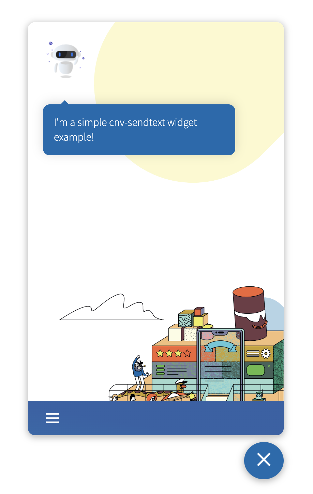
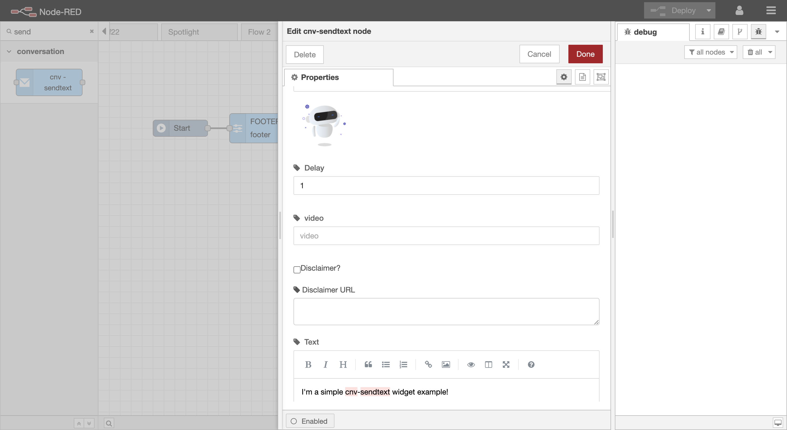
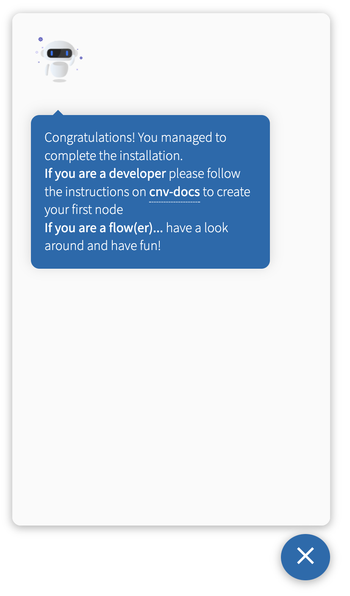

# TinyMe

An open source flow based web chat application for everyone. TinyMe is a web chat on which anyone can put on their own applications and can have multiple purposes and easily collect feedback from the users in an intuitive way. The chat itself is built on a flow driven approach, having multiple widgets with various functionalities that can be tied together trough a flow creating then the desired chat with the client and its different responses based on the user input.

<a name="get-started"></a>

## Get started

Before going through the code, we recommend that you first see the [project structure](#project-structure) and [what is a widget](#what-is-widget). Being an open-source project means that you can contribute for the project, so if you're interested in creating a new widget then checkout [how to create a widget](#create-new-widget) as well as [what is expected from a contributor](#expected-contrib). FInally you can check out how to deploy and run for [development](#deploy-dev) as well as for [production](#deploy-dev).

<a name="project-structure"></a>

## In a rush? 

Jump right into the deployment with docker and docker-compose [Deploy on production with docker-compose](#deploy-on-production-with-docker-compose)

## Project structure

The whole project is divided in to the following repositories:

-   [`cnv-middleware`](https://github.com/conversionplatform/cnv-middleware)
    -   this is the communication channel (backend) of the entire project.
    -   it is a nodeJS application written in typescript, using the NestJS framework.
    -   for the database, it uses ArangoDB, a document and graph database.
-   [`cnv-plugins`](https://github.com/conversionplatform/cnv-plugins)
    -   here we can find the code for each widget for the [Node-RED platform](https://nodered.org/).
-   [`cnv-react-app`](https://github.com/conversionplatform/cnv-react-app)
    -   the frontend application of the project.
    -   made with react.
    -   has a limited set of widgets that can be easily extended by installing third party ones such as [cnv-react-plugins](https://github.com/conversionplatform/cnv-react-plugins).
-   [`cnv-react-plugins`](https://github.com/conversionplatform/cnv-react-plugins)
    -   holds the widgets to be used in the [cnv-react-app](https://github.com/conversionplatform/cnv-react-app) project.
    -   you can check the complete widgets list on [storybook](https://conversation-platform.productdock.com/storybook/?path=/story/example-introduction--page).

<a name="what-is-widget"></a>

## What is a widget

A widget is a component with a specific logic for the application to run. Since this is a web chat using a flow based system, think of the entire flow the logic of the chat itself and a widget a piece of that logic. A widget has to have two parts: the [front-end](#what-is-widget-front-end) part and the [Node-RED](#what-is-widget-node-red) part.

<a name="what-is-widget-front-end"></a>

### Front-end

The front-end code of each widget is present on the [cnv-react-plugins](https://github.com/conversionplatform/cnv-react-plugins) repository. It is made with React and typescript and Sass for the styling.

This part is the one responsible for showing the end user what the widget is about as well as handling the interaction with the user and sending data to the [cnv-middleware](#project-structure).



<a name="what-is-widget-node-red"></a>

### Node-RED

The node-red code of each widget is present on the [cnv-plugins](https://github.com/conversionplatform/cnv-plugins) repository and each widget has a `.html` and `.js` file following the conventions from [Node-RED platform](https://nodered.org/).

Not only is this responsible for displaying the UI/UX on the node-red application, but it is also responsible for the logic of user response on the widget and redirection of the flow.



<a name="create-new-widget"></a>

## How to create a new widget

To create a new widget two things are needed:

-   create a front-end component on the [cnv-react-plugins](https://github.com/conversionplatform/cnv-react-plugins) repository.

    -   it has to be a react component.
    -   the styling can be of your choosing but we recommend using [Sass](https://sass-lang.com/).

-   create a node-red component on the [cnv-plugins](https://github.com/conversionplatform/cnv-plugins) repository.
    -   it has to have a `.html` file responsible for the UI/UX on the node Red.
    -   it has to have a `.js` file responsible for the logic of the flow.
    -   both files must adhere to the [Node-RED platform](https://nodered.org/) conventions.

Once you have the code on each repository you can test by following the instructions on [how to deploy and run for development](#deploy-dev).

<a name="deploy-dev"></a>

## Deploy on production with docker-compose

This default setup will bring up all the project dependencies including:
- Arangodb
- cnv-react-app
- cnv-middleware

```bash
cd docker
docker-compose up
```

Then point your browser to your [localhost](http://localhost)

You will land on the admin dashboard. use the default user and password set on the docker-compose. If you didn't change them use:
- User: admin
- Password: secret

You can manage all of the settings and flows from the dashboard, but you are free to reach them directly:
- [app](http://localhost/app/#/default). You may notice the /#/default. The Node-Red is bundled with a default flow to begin with.
- have a look around on [Node-red](http://localhost/red/)
- feel free to explore the middleware [api](http://localhost/api/). There is a lot of cool geek stuff in there 👀

Congratulations. 🎉 You should see the following greeting message.



If you see the image above, that means that you are all set. 😉
## Deploy and run for development

To begin with, `git clone` every repository to a folder of your choosing.

#### [`cnv-middleware`](https://github.com/conversionplatform/cnv-middleware)

```bash
git clone git@github.com:conversionplatform/cnv-middleware.git
```

#### [`cnv-plugins`](https://github.com/conversionplatform/cnv-plugins)

```bash
git clone git@github.com:conversionplatform/cnv-plugins.git
```

#### [`cnv-react-app`](https://github.com/conversionplatform/cnv-react-app)

```bash
git clone git@github.com:conversionplatform/cnv-react-app.git
```

#### [`cnv-react-plugins`](https://github.com/conversionplatform/cnv-react-plugins)

```bash
git clone git@github.com:conversionplatform/cnv-react-plugins.git
```

Once you have all the repositories on your machine you'll have to install all the modules. So, for each repo run:

```bash
yarn
```

Now that you have everything installed, you'll need to link the `cnv-plugins` to the `cnv-middleware` repository as well as the `cnv-react-plugins` to the `cnv-react-app`.

To do this you must first build `cnv-plugins` and `cnv-react-plugins` by running:

```bash
yarn build
```

on each one.

Once that's done, link the repos by running

```bash
yarn preinstall:dev
```

on `cnv-middleware` and `cnv-react-app`.

You should by now have everything ready to run the application. To deploy locally and test it simply run on `cnv-react-app`

```bash
yarn start
```

and on `cnv-middleware`

```bash
yarn start:dev
```

You can now view the entire application locally by going to the following urls:

-   front-end : http://localhost:1234/
-   node-red : http://localhost:1880/red
-   swagger api: http://localhost:3000/

<a name="deploy-prod"></a>

## Deploy and run for production

For production the only thing needed is to run

```bash
yarn build:prod
```

on each project to build it and the built code will be available in the `dist` folder.

## Integrate into your website

In the [examples folder](examples/index.html) you will find a practical example on how to integrate the app into your website. 

Try the examples with [http-server](https://www.npmjs.com/package/http-server) by running
```
cd examples && http-server . -p 1234
```
Its just a matter of importing the required assets from your publicly available react app:

- start by importing the css from the bundle by importing chat.css into the head of your page
```html
    <head>
        ...
    <link rel="stylesheet" href="http://localhost/app/chat.css">
        ...
    </head>

```

- then import chat.js module on the bottom of your html tag
```html
    <body>
        ...
    <script type="module" src="http://localhost/app/chat.js"  charset="utf-8"></script>
        ...
    </body>
```

the custom component is now ready to be displayed on your page. Just find a place for it to live and add the component there, like so:

```html
    <body>
        ...
        <footer>
            ...
            <conversation-app flow-id="/default" host="http://localhost"></conversation-app>
        </footer>
    </body>
```


<a name="expected-contrib"></a>

## What is expected from a contributor

To help the process of out team to analyze the proposed contributions, a few things are expected:

-   the contributor owns all the code.
-   the code was properly tested and has the test file attached to it.
-   a simple documentation explaining the solution is provided.
-   a live deployed example of the solution is presented.

If all of the above requirements are not present on the pull request, team will not evaluate the contribution.
